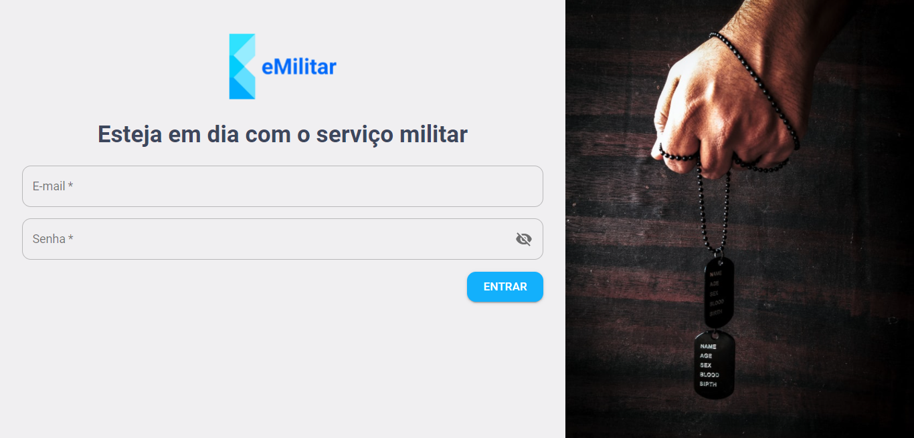
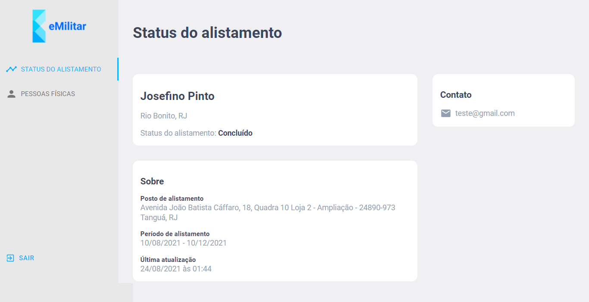
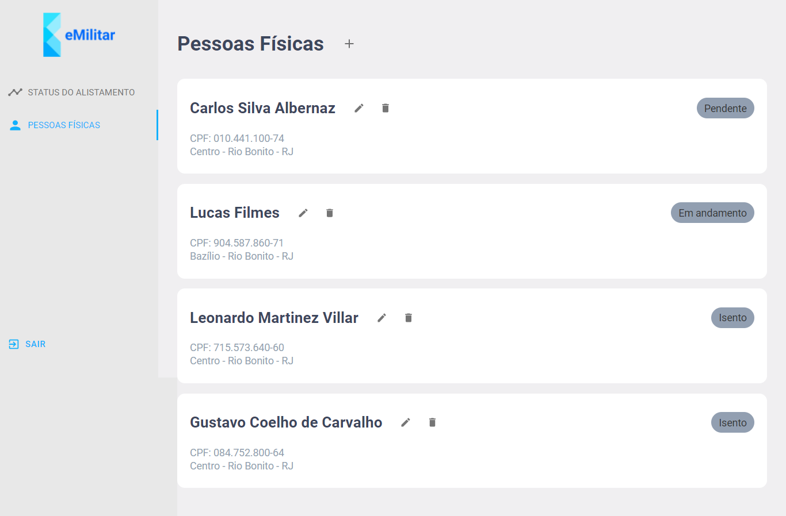
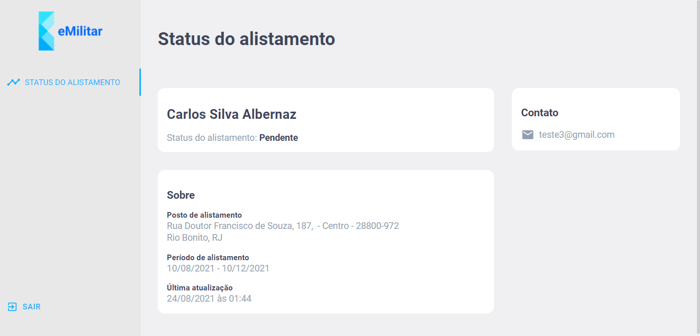
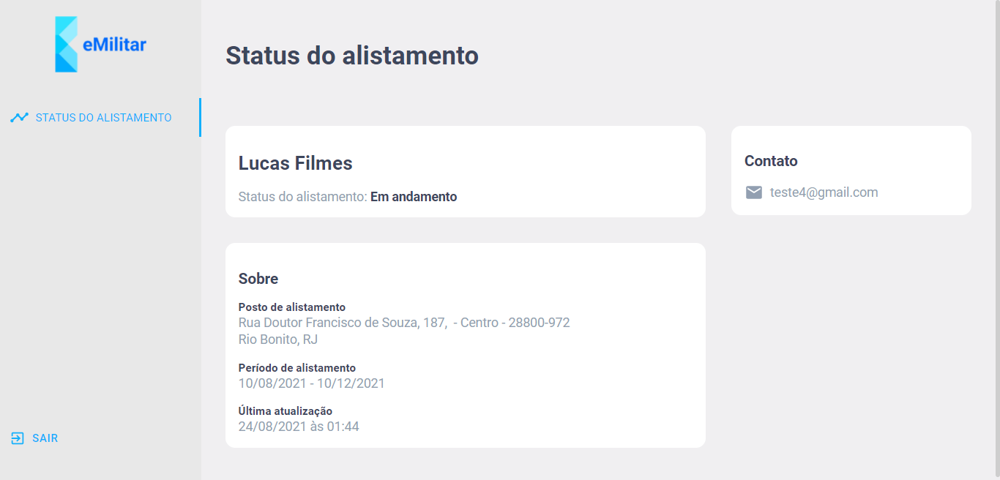

<h1 align="center">
   
</h1>

<p align="center">
  <a href="https://github.com/fernandogatto/" target="_blank">
    
  </a>

  <a href="https://github.com/sapucaialuann/" target="_blank">
    
  </a>

  

  

  
</p>

> Web application for verification of the military enlistment service.

## 🔗 Table of contents
- [API](#api)
- [Technologies](#technologies)
- [Installation](#installation)
- [Getting start](#start)
- [Project](#project)
- [Contribute](#contribute)
- [License](#license)

## 📚 API <a name="api"/>

To get the API, follow this [eMilitar API](https://emilitar-api.herokuapp.com/swagger-ui/index.html?configUrl=/v3/api-docs/swagger-config).

[Click here](https://github.com/dnfetheus/devappcorp-api) to see the API repository.

## 📌 Technologies <a name="technologies"/>

- [ReactJS](https://pt-br.reactjs.org/)
- [React Redux](https://react-redux.js.org/)
- [Styled Components](https://styled-components.com/)

## 📂 Installation <a name="installation"/>

First of all, it is important that you have installed [Yarn](https://yarnpkg.com/).

So, run this command in terminal to clone the project via HTTPS:

```bash
git clone https://github.com/fernandogatto/emilitar-web.git
```

SSH URLs provide access to a Git repository via SSH, a secure protocol. If you have a SSH key registered in your Github account, clone the project using this command:

```bash
git@github.com:fernandogatto/emilitar-web.git
```

**Install dependencies**

```bash
yarn install
```

## 🚀 Getting start <a name="start"/>

Run the following command in order in terminal:

```bash
# Start the server
yarn start
```

## 💻 Project <a name="project"/>

The project consists of the vision of two actors: the public servant and the individual.

Sign in



Status public servant:



Physical people:



Status individual:





## 👍 Contribute <a name="contribute"/>

- Fork this repository.
- Create a branch with your resource: ```git checkout -b feature/my-feature```
- Submit changes: ```git commit -m "feat: My new feature"```
- Push your branch: ```git push origin feature/my-feature```

## 📕 License <a name="license"/>

Released in 2021. This project is under the [MIT License](https://choosealicense.com/licenses/mit/).

Build with 💜 by [Fernando Gatto](https://github.com/fernandogatto/) and [Luann Sapucaia](https://github.com/sapucaialuann).
